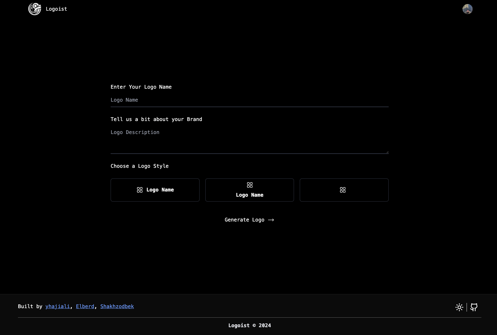

# Logoist

> Logoist is a logo design service that creates unique, minimalistic logos tailored to your brand's identity.

## Authors

This project was built by:

- Yusuf: [𝕏](https://twitter.com/yhajiali_) | [Github](https://github.com/yhajiali) | [LinkedIn](https://linkedin.com/in/yhajiali)
- Elberd: [𝕏](https://twitter.com/codeblazer06) | [Github](https://github.com/egalaiev) | [LinkedIn](http://linkedin.com/in/elberd-galaiev-8a81351b2/)
- Shakhzodbek: [𝕏](https://twitter.com/ShaxKingsley) | [Github](https://github.com/Sabirov07) | [LinkedIn](http://linkedin.com/in/shakhzodbek-sabirov-3b0818221)

<!--  -->


## Tech Stack

- NextJs as the framework
- Dall-E 3 from OpenAI for the AI model
- Clerk.com for authentication
- Vercel for hosting
- Upstash for rate limiting

## Getting Started

First, duplicate the `.env` file into a new file named `.env.local`. Update the dummy values with your keys.

Refer to :

- [REPLICATE](https://replicate.com/docs/get-started/nodejs)
- [OPENAI](https://platform.openai.com/docs/quickstart)
- [CLERK](https://clerk.com/docs/quickstarts/nextjs)
- [UPSTASH](https://upstash.com/docs/redis/overall/getstarted)

The first time you are running this project, you will need to install the dependencies. Run this command in your terminal:

```bash
yarn
```

To start the app, run:

```bash
yarn dev
```

Open [http://localhost:3000](http://localhost:3000) with your browser to see the result.

You can start editing the page by modifying `app/page.tsx`. The page auto-updates as you edit the file.
